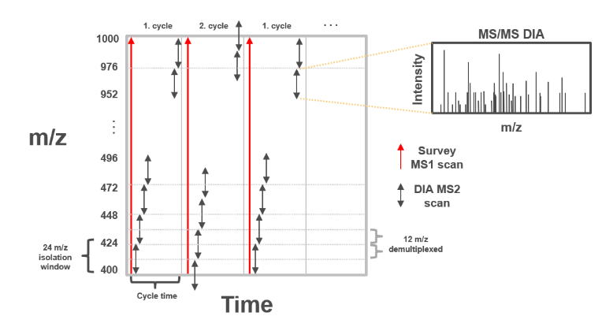
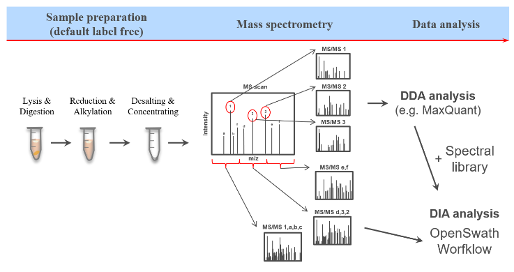
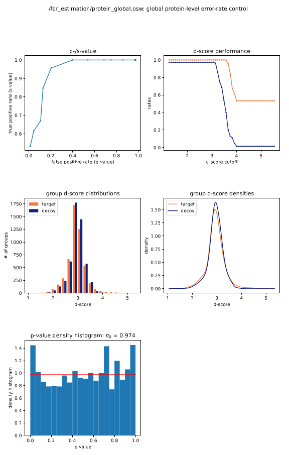

# *Proteomics Data Independent Analysis (DIA) with OpenSwathWorkflow*

### Compiled by *Desmond Akabetso Nde* 
### Last updated on the *19 of September 2024* 
### *Enjoy reading through and do not hesitate to comment your thougths on my approach and analysis.*

## Aim: 
- Navigate the pathway to analyze data independent acquisition (DIA) mass spectrometry (MS) data using OpenSwathWorkflow
-  Detect different Spike-in sample dataset with case study: Ecoli in a HEK-Ecoli Benchmark DIA dataset.
- Reproduce Workflow from [Galaxy](https://usegalaxy.org/training-material/topics/proteomics/tutorials/DIA_Analysis_OSW/tutorial.html#hands-on-dia-analysis-using-openswathworkflow) in linux environment for detailed and deep understanding of everystep.
	
## Workflow from Galaxy:
1. Introduction
2. dataset description
3. OpenSwathWorkflow DIA analysis
4. Pyprophet: merge OpenSwathWorkflow output files
5. FDR estimation with pyprophet score
- Apply scores to peptide
- Apply scores to protein
- export results in tsv file
6. Perform statistical analysis with swath2stats.
7. Conclusion

## Introduction

According to [Shubham Gupta et al.](https://www.nature.com/articles/s42003-023-05437-2), Data independent acquisition (DIA) is a popular method to probe the proteome landscape of a biological sample in liquid chromatography coupled to tandem mass-spectrometry (LC-MS/MS). They mentioned it has been proven to have superior reproducibility and better quantitative performance compared to other methods, such as shotgun proteomics due to its fixed MS/MS acquisition scheme and MS2 based quantification. In clinical studies, it is often necessary to analyze a large number of samples to identify trends or to achieve enough statistical power in genetically diverse populations. In such large-scale studies, it is often practically infeasible to acquire all runs under homogeneous conditions at the same time on a single instrument. Thus, being able to compare data across larger time frames of LC-MS/MS acquisition or across multiple instruments is becoming increasingly important for MS-based proteomics.

For such large-scale DIA studies, sources of non-biological variation include sample preparation, retention time shifts, ionization and mass-spectrometer related artifacts.

As defined in Galaxy, Proteome is the entirety of proteins in a biological system(tissue, organism...) most often performed by mass spectromety that enables great sensitivity and throughput. Especially for complex protein mixtures, bottom-up mass spectrometry is the standard approach in which proteins are digested with specific protease into peptides and the measured peptides are in silico reassembled into the corresponding proteins. Inside the mass spectrometer, not only the MS1 peptide are measured but they are further fragmented into smaller peptides which are measured again as MS2 level refered as tandem-mass spectrometry (MS/MS). Quantification of peptides are mostly done by measuring the area under the curve of the MS1 level peptide peaks, but special techniques such as TMT allow to quantify peptides on MS2 level. through this approach, several thouasands of proteins can be identified and measured.

**Figure 1:** Measurement principles of DIA and m/z window schema of staggered DIA printed from Galaxy.

As seen on the figure above, the system performs a series of cycle scan, the red arrows represent MS1 scan which are ful scans of all ions within a wide mass-to-charge(m/z) range of 400-1000m/z. The black arrows represents DIA MS2 scans where the instrument isolates specific ranges (isolation windows) and gragments the ions within that window to get detailed information (MS/MS data). In this case, each isolation window has a width of 24m/z and within each window, ions are fragmented to measure their intensities. Within each cycle, the instrument alternates between one MS1 scan and several MS2 scans. 

**Demultiplexing** in DIA refers to the seperation or untangling of the complex data that results when multiple ions are analyzed together in a single isolation window. This is necessary because multiple precursor ions are fragmented together resulting to complex MS/MS spectra that contain fragments from different precursor ions simultanously which can overlap in the same window when mixed together. Demultiplexing computationaly seperates these mixed fragment ions so each fragment is correctly assigned to it's corresponding precursor ion.

And finally, the spectra shows the intensity distribution of ions detected after fragmentation. the peaks represent fragment ions and their intensities are used to quantify the amount of specific peptides or proteins.

**Figure 2:** Sample preparation and spectral libraries for the identification of peptides in DIA MS2 scan.

AS describe in figure 2, a more common approach is the bottom-up approach where, cells are lysed, digested and the first peptides fragmentations are ionised in the mass spectrometer. A spectral library is then generated at the end point of this process which takes into account all the ions precursors in each cycle. It contains experimentally measured MS2 spectra which are specific for each precursor.

## Dataset description

The Dataset used for this study as described by Galaxy was downloaded from [Zenodo](https://zenodo.org/records/4307762). They lysed HEK and E.coli cell pellets with 5 % SDS In order to solubilize cell memranes and proteins, 50 mM triethylammonium bicarbonate (TEAB) to stabilize the proteins and protect from degradation, pH 7.55. They further ensured all disulfied bonds were broken through reduction of the protein extracts by adding f.c. 5 mM TCEP and alkylated by the addition of f.c. 10 mM iodacetamide to prevent the reformation of disulfied bonds and proceeded with protein digestion and purification on S-Trap columns. To ensure protein binding to the S-Trap columns, the samples were acidified to a final concentration of 1.2 % phosphoric acid (~ pH 2). Six times the sample volume S-Trap buffer (90% aqueous methanol containing a final concentration of 100 mM TEAB, pH 7.1) was added to the samples which were then loaded on the columns and washed with S-Trap buffer. Protein digestion to peptides was performed with trypsin and LysC for one hour at 47 °C. Peptides were eluted in three steps with (1) 50 mM TEAB, (2) 0.2 % aqueous formic acid and (3) 50 % acetonitrile containing 0.2 % formic acid. Eluted peptides of HEK and E.coli were mixed in two different ratios and four replicates of each Spike/in ratio were measured:

Sample    HEK    E.coli    MS method
Sample1    2.5      0.15        DIA
Sample2    2.5      0.15        DIA
Sample3    2.5      0.15        DIA
Sample4    2.5      0.15        DIA
Sample5    2.5      0.80        DIA
Sample6    2.5      0.80        DIA
Sample7    2.5      0.80        DIA
Sample8    2.5      0.80        DIA

Additionally, iRT peptides were added and 1µg of each samples was measured using data independent acquisition with a Q-Exactive Plus mass spectrometer. Briefly, a scan range from 400-1000 m/Z was first covered by an MS1 scan followed by 25 consecutive MS2 scans (each 24 m/z broad). In the next cycle another MS1 scan was acquired followd by 26 MS2 scans (also 24m/z broad) in which the window centers were shifted by 50% compared to the previous cycle of MS2 scans. The resulting raw files contain overlapping MS2 scans.

## OpenSwathWorkflow DIA analysis

Before begining the DIA analysis, the dataset was contained raw files from thermoscientific, a more recomendable step is first to convert these raw data to mass spectrometry markup language (mzML) understangable by the OpenSwathWorkflow. Galaxy proposed to use [msconvert](https://proteowizard.sourceforge.io/tools/msconvert.html) from proteowizard  as a more flexible tool for this process. msconvert has dependencies built only in windows for thermoscientific raw data. In order to execute this process in my UNIX environment, it was easier to introduce docker container in which I pulled a vendor image of msconvert and executed the windows version of msconvert through wine. Introducing the **Demultiplexer** to effectively seperates fragments and their precursors eliminating overlap in the conversion process. Here is my [script](https://github.com/akabetso/Proteomics_DIA_anylysis_using_OpenSwathWorkflow/blob/master/script/msconvert.sh) for msconvert using parameters described in Galaxy and applying them accourding to msconversion [documentation](https://proteowizard.sourceforge.io/tools/msconvert.html).

Next was to proceed OpenSwathWorkflow, I downloaded and installed OpenSwathWorkflow version 3.1.0-pre-exported-20240524 in my linux terminal but a more appropriate method would have been to continue with Docker to pull a vendor image as this ensures reproducibility. the write_ini was used to generate an ini file in which I carefully mofified the parameters withing as described in Galaxy. The isolation window was not defined as OpenSwath can automatically detect in the datafile the isolation windows. the Openwath looped through all samples and the respective outputs were mered downstream with pyprophet. Here is my [script for OpenSwathWorkflow](https://github.com/akabetso/Proteomics_DIA_anylysis_using_OpenSwathWorkflow/blob/master/script/openswathworkflow.sh) with with parameters described in Galaxy and executed according to OpenSwathWorkflow documentation

The OpenSwath used a mass tolerance of 10 ppm (parts per million) which is the expected deviation between the measured m/z and the theoritical m/z. this information generaly depends on the type of spectrometer used and should be specified by the devoloper. The indexed retention time peptide (iRT) containing synthetic peptide was equally used to help align the retention time of peptides accross multiple runs.

## Pyprophet Score

Post OpenSwathWorkflow was applying pyprophet to score the Swath files and discuss the false dicovery rate (FDR estimation). As mentioned above, the first step was to merged the swath files using pyprphet mered. The scoring process employs machine learning algorithm to score and validate the peptide and protein identifications. This process helps distinguis between true identifications and false positives. q-values are generated which is a measure of significance in multiple hypothesis testing, which indicates the minimum FDR at which a particular peptide identification is considered true. A lower FDR (<5%) means that more of the identifications are true, while a higher FDR translate a higher chance of false positive. 

In order to ensure reprocucibility, I used a vendor image of pyprophet contained in Docker for scoring the Swath data. It was executed in 5 different stages, the fist two steps was scoring the peptides using pyprphet peptide option with experiment-wide and later with global. The experiment-wide takes into account the FDR estimation control accross the entire experiment while the global takes into acount multiple datasets or experiments and integrate the results. The distribution of the target protein and the decoy (false positive) does not differ much from each other, we expect a distribution where the target protein differs much from the decoy to show that the algorithm seperates well targets from fasle positives.

The second two executions was running pyprophet proteins first on exeriment-wide and secondly globaly taking into acount all the runs and integrating them together. The protein inference figure 3 shows similar results as the peptide inference, the probality of multiple decoy peptides from the same protein having a high score is lower than for multiple target peptides from the same protein, This the discriminatory scores on protein level are higher.

**Figure 3:** Protein inference pyprophet report

The q-/s value plot shows the relationship between false positive rate (q-value) and true positive rate (s-value). Typically we expect to see a curve that rises sharply indicating a strong ability to distinguish true from false positives. In our case, at q-value > 0.4, the system is unable to differentiate between false positive and true positive. Tthe curve levels off too early suggesting weaker performance. Generally, I did not have a good seperation between the target proteins and the false positive. what is important to do here is to rerum the workflow and consider using OpenSwathWorkflow in a Docker container. I proceeded to statiscal anylis to complete the pipelinge but reduced the q-value to pass the filter and to see some peptides. but this peptides are not confident since we can't tell if they are false positive or not based on the q-value.

## SWATH2stats

Here we exported the protein infernce in pyprophet in a tsv file and introduced in swath2stats for statical analysis. SWATH2stats was downloaded and installed in R for downstream analysis.statiscal results can be found in the [FDR estimation](https://github.com/akabetso/Proteomics_DIA_anylysis_using_OpenSwathWorkflow/tree/master/docker/pyprophet/FDR_estimation) directory

